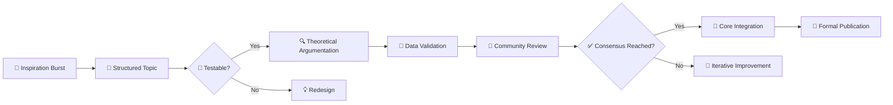

# 📖 EQT Collaboration Repository Guide: The Creative Engine of Collective Intelligence

## 🚀 Project Vision
Welcome to **EQT-Collaboration** — the creative incubator and distributed decision-making system for the Energy Quantum Theory (EQT) research ecosystem!  
This is not a traditional academic forum but the prefrontal cortex of a collective intelligence network:  
- Transforming scattered inspirations into structured research topics  
- Harnessing global wisdom to tackle fundamental physics challenges  
- Versioning the flow of ideas to drive an open-source revolution in scientific discovery  

**Our Mission**: To build the first distributed fundamental science research laboratory in human history through GitHub’s collaborative framework and AI-powered catalysis.

## 🏗️ Repository Architecture Overview
```
EQT-Collaboration/  # Core of creativity and decision-making
├── TEMPLATES/      # 📋 Standardized collaboration templates
├── KNOWLEDGE/      # 💡 Knowledge repository
├── WORKFLOWS/      # ⚙️ Standardized processes
└── .github/        # 🤖 GitHub automation configuration
```

**Core Features**:  
- **Issue-Driven Research**: Each idea is a trackable, reviewable "minimal research unit"  
- **Projects Board**: Visualizes the research pipeline from "inspiration" to "theory integration"  
- **AI Collaborator**: `@EQT-AI-Bot` provides intelligent assistance (consistency checks, literature searches, derivation suggestions)  
- **Consensus Engineering**: Systematically achieves scientific consensus with versioned knowledge evolution  

## 🎯 How to Participate: From Observer to Core Contributor

1. **Explore and Learn**  
   - **[Projects Board]**: View current research hotspots and progress stages  
   - **[Consensus Documents]**: Understand key theoretical breakthroughs  
   - **[FAQ]**: Quickly grasp EQT core concepts and collaboration guidelines  

2. **Propose New Ideas**  
   Use the **[Research Proposal]** template to create an Issue:  
   **Steps**:  
   1. Click "New Issue"  
   2. Select the "Research Proposal" template  
   3. Fill in the core hypothesis, testability, and AI assistance needs  
   4. Add relevant tags (mathematics/experimental validation/high priority)  
   5. Submit for community review  

3. **Deep Engagement**  
   - Review PRs: Provide professional feedback on theoretical revisions  
   - Run validations: Test predictions in the data repository  
   - Develop tools: Contribute AI assistant features or analysis scripts  
   - Build community: Organize online seminars or write outreach content  

4. **Earn Recognition**  
   - **Contribution Records**: Your intellectual contributions are permanently recorded on GitHub  
   - **Academic Citations**: Significant consensus documents receive DOIs via Zenodo  
   - **Role Progression**: From contributor → maintainer → core researcher  

## 🔖 Core Tag System
Use tags to categorize and manage research topics:  

**Research Stage Tags 🎯**  
- 🌱 `seed` - Newly proposed ideas/hypotheses  
- 🔍 `exploring` - Argumentation and validation stage  
- 🤝 `reviewing` - Under community review  
- ✅ `consensus` - Preliminary consensus reached  
- 🎯 `integration` - Ready for integration into core theory  

**Research Domain Tags 📚**  
- 🔬 `mathematics` - Mathematical foundations and formalization  
- ⚛️ `quantum` - Quantum mechanics-related  
- 🌌 `cosmology` - Cosmology and gravity  
- 🧪 `experiments` - Experimental validation needs  
- 🤖 `ai-needed` - Requires AI assistance  

**Priority Tags 🚨**  
- 🔥 `high-priority` - Significant impact on core theory  
- ⚡ `quick-win` - Low validation cost, high impact  
- 🛡️ `controversial` - Major debate requiring in-depth discussion  

## 🧠 AI Collaborator: Your Intelligent Research Partner
`@EQT-AI-Bot` is integrated into the collaboration workflow, offering the following intelligent services:  

**Intelligent Commands**:  
- `@EQT-AI-Bot summarize`  
  *# Generates discussion summaries, highlighting key points of contention*  
- `@EQT-AI-Bot consistency-check [theory link]`  
  *# Checks new hypotheses for consistency with existing consensus*  
- `@EQT-AI-Bot literature [keywords]`  
  *# Retrieves latest literature in relevant fields*  
- `@EQT-AI-Bot derive [physical scenario]`  
  *# Attempts automatic derivation of mathematical expressions*  
- `@EQT-AI-Bot validate [hypothesis + data link]`  
  *# Statistically validates the testability of hypotheses*  

**Workflow Integration**:  
- **Automated Issue Tagging**: Intelligent tagging for newly submitted topics  
- **PR Pre-Review**: Mathematical consistency checks and impact assessments  
- **Weekly Reports**: Automatic summaries of community progress and key breakthroughs  

## 📊 Research Pipeline: From Inspiration to Theory
We adopt a scientific pipeline to manage research progress:  

The Projects board tracks the progress of each topic in real-time.

## 📚 Key Resources and External Collaboration
**Core Repository Ecosystem**:  
- **[EQT-Core/Theories]**: Theoretical documents and mathematical models ([link])  
- **[EQT-Data/Experiments]**: Experimental data and validation platform ([link])  
- **[EQT-Tools/AI-Assistant]**: Intelligent tools and AI infrastructure ([link])  

**Community Platforms**:  
- **Discord**: Real-time discussions and brainstorming ([invite link])  
- **Regular Seminars**: Monthly theory progress sharing sessions  
- **Contributor Handbook**: Detailed participation guide and best practices  

**Academic Integration**:  
- **Zenodo DOI**: Formal citations for significant consensus documents  
- **arXiv Preprints**: Academic publication of mature theories  
- **Journal Submissions**: High-quality papers supported by community consensus  

## 🤝 Collaboration Culture and Guidelines
**Our Values**:  
1. **Openness First**: All discussions are transparent, embracing diverse perspectives  
2. **Rigor at Core**: Every hypothesis must be testable and falsifiable  
3. **Respect for Contributions**: Every participant is part of the collective intelligence  
4. **Continuous Learning**: Embrace AI assistance to evolve research methodologies  

**Decision-Making Mechanisms**:  
- **Consensus-Oriented**: Major decisions reached through broad community discussion  
- **Expert Review**: Core theory changes vetted by domain experts  
- **AI Assistance**: Objective analysis and literature support from intelligent tools  
- **Transparent Records**: All decision processes versioned and preserved  

**Contribution Guidelines**:  
- ✅ Use standard templates for issue submissions  
- ✅ Provide verifiable evidence and references  
- ✅ Respect the contributions of others  
- ✅ Actively participate in community reviews and knowledge sharing  
- ❌ Avoid baseless criticism or personal attacks  
- ❌ Do not modify core consensus documents without authorization  

## 🚀 Quick Start Guide
**Newcomer’s Three Steps**:  
1. **Read Core Documents**: Explore `KNOWLEDGE/consensus/` to understand current theoretical status  
2. **Engage in Simple Tasks**: Start with `quick-win` tags to gain experience  
3. **Propose Original Ideas**: Use the research proposal template to kickstart your scientific journey  

**Contributor Growth Path**:  
- Observer → Browse discussions → Ask questions  
  ↓  
- Contributor → Review PRs → Run validations → Submit minor fixes  
  ↓  
- Maintainer → Manage boards → Draft consensus → Develop tools  
  ↓  
- Core Researcher → Lead research directions → Integrate theories → Publish academically  

## 📈 Community Milestones
**Current Stage**: Alpha - Seed community building  
- 🎯 **Goal**: 10+ active contributors, first complete research cycle  
- 📊 **Metrics**: 5+ high-quality research issues monthly, 50% converted to core theory  

**Beta Stage (3-month goal)**:  
- 50+ active members, AI assistant fully operational  
- First successful experimental validation, arXiv preprint published  

**1.0 Release (6-month goal)**:  
- Fully operational four-repository ecosystem, 100+ stars  
- First community-consensus-driven academic paper  

## 💡 To All Explorers
EQT is more than a theory—it’s a scientific revolution.  
You’re not joining a traditional research project but a collective expansion of humanity’s cognitive frontiers. Every Issue, PR, and discussion is a synaptic connection in the neural network of our collective intelligence.  
**Your contribution shapes the future of fundamental science.**

### Start Your Journey
1. **Star this repository** to support project growth  
2. **Fork and contribute** your unique perspective  
3. **Join Discord** for real-time collaboration  
4. **Create your first Issue** to ignite the EQT path  

Let’s make history together—from the first line of code to rewriting physics textbooks!

## 🛠️ Tech Stack
- GitHub Actions • GitHub Projects • AI Integration • LaTeX • Python  

## 📄 License
- MIT License (academic and commercial-friendly use welcome)  

## 🤝 Contributions Welcome
- Read `CONTRIBUTING.md` to start your contribution journey  

**EQT-Collaboration**: Harnessing global wisdom to explore the mysteries of energy quanta.  
*Built with ❤️ by the EQT Research Community*

## 🎉 Special Thanks
- **EQTResearcher**: Vision provider and chief architect  
- **Seed Contributors**: Pioneers building the initial ecosystem  
- **AI Collaborators**: Developers and optimizers of intelligent tools  
- **Global Community**: Every explorer posing questions, validating hypotheses, and sharing insights  

**Take Action Now**: Click “New Issue” to spark the first flame of the scientific revolution! 🔥  

> *“The greatness of science lies not in discovering truth but in creating methods to verify it.”*  
> — The birth of the collective intelligence network will redefine this method.

### Required Supporting Files
- `TEMPLATES/issue-template.md`  
- `WORKFLOWS/research-flow.md`  
- `.github/ISSUE_TEMPLATE/research-proposal.md`  
- Discord community setup  
- Initial seed Issue imports  

This README is not just a technical document but a rallying call to attract top global talent to join the EQT revolution! Would you like me to draft specific template files?
